# egui_xyflow

A node graph editor for [egui](https://github.com/emilk/egui). Build interactive flow charts, diagrams, pipelines, and visualizations — inspired by [xyflow](https://xyflow.com/) (React Flow).

[](https://crates.io/crates/egui_xyflow)
[](https://docs.rs/egui_xyflow)
[](LICENSE)

<table>
<tr>
<td align="center">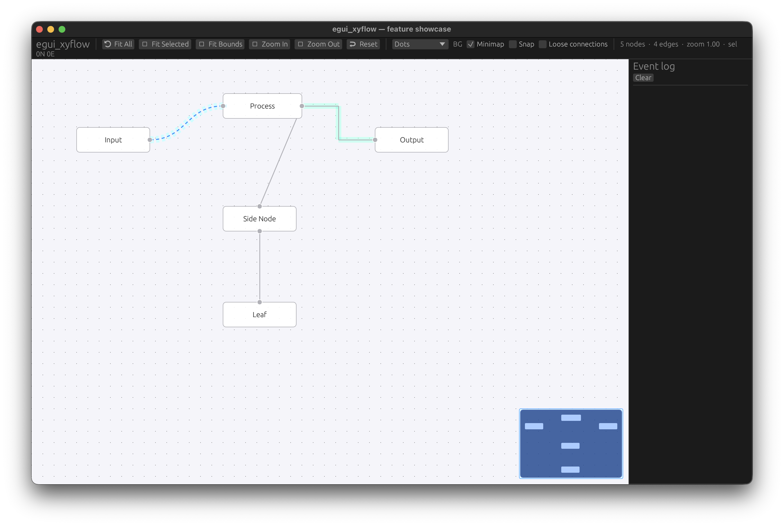<br><b>Basic Flow</b></td>
<td align="center">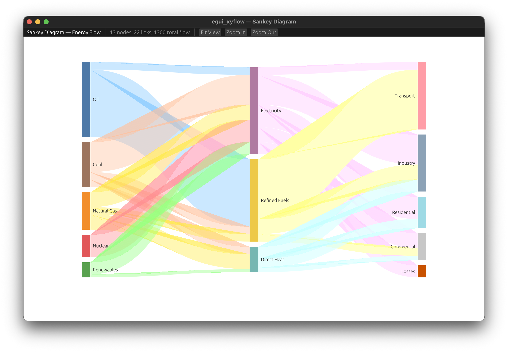<br><b>Sankey Diagram</b></td>
</tr>
<tr>
<td align="center">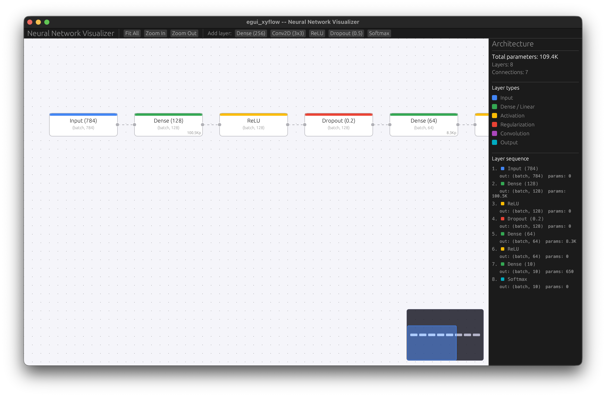<br><b>Neural Network</b></td>
<td align="center">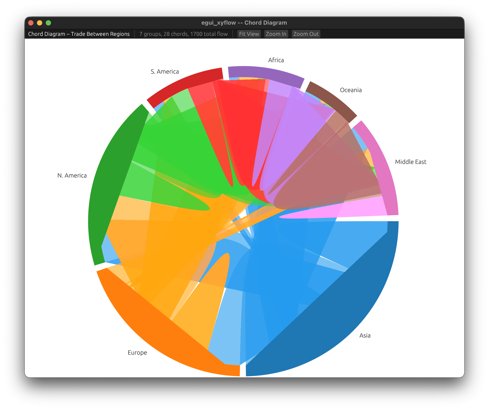<br><b>Chord Diagram</b></td>
</tr>
</table>

<details>
<summary>See all 15 examples</summary>

<table>
<tr>
<td align="center"><br><b>Basic Flow</b></td>
<td align="center">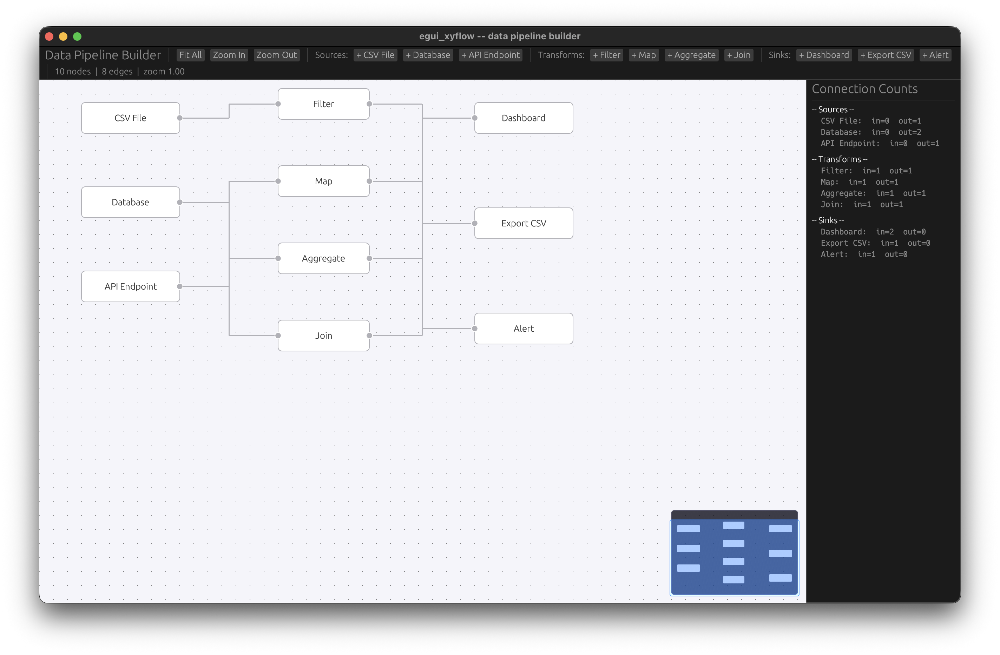<br><b>Data Pipeline</b></td>
</tr>
<tr>
<td align="center"><br><b>Neural Network</b></td>
<td align="center">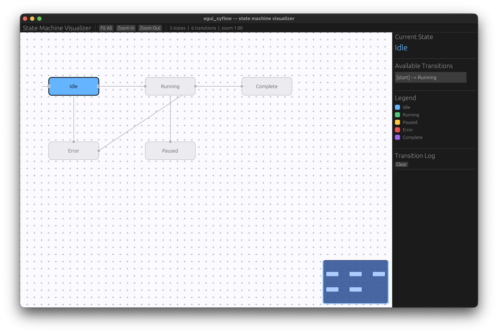<br><b>State Machine</b></td>
</tr>
<tr>
<td align="center">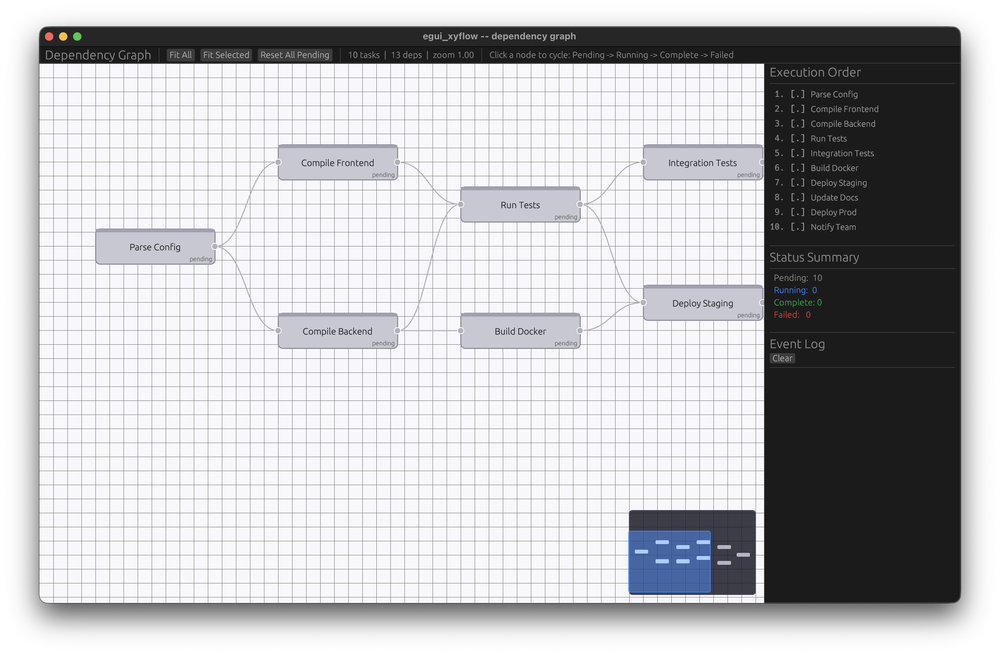<br><b>Dependency Graph</b></td>
<td align="center">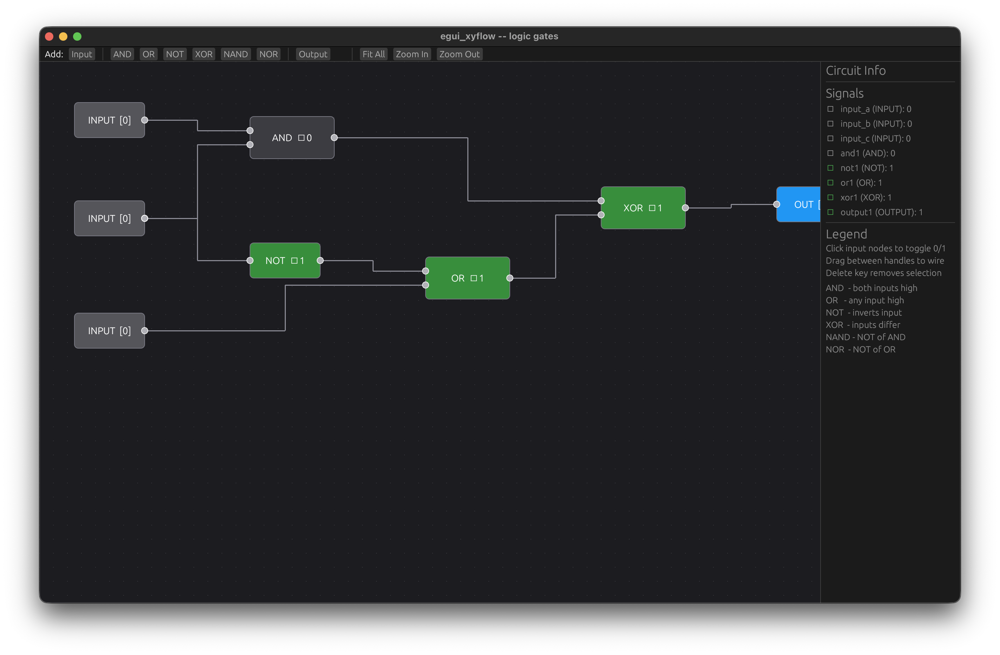<br><b>Logic Gates</b></td>
</tr>
<tr>
<td align="center"><br><b>Sankey Diagram</b></td>
<td align="center"><br><b>Chord Diagram</b></td>
</tr>
<tr>
<td align="center">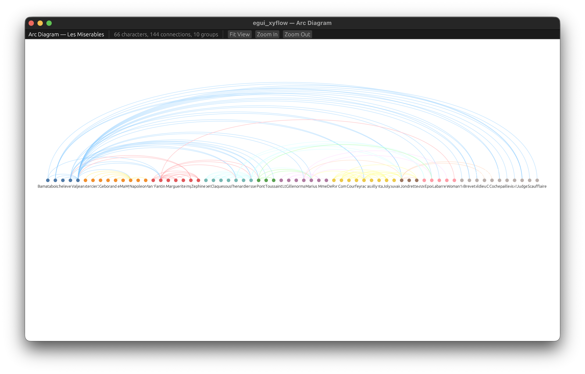<br><b>Arc Diagram</b></td>
<td align="center">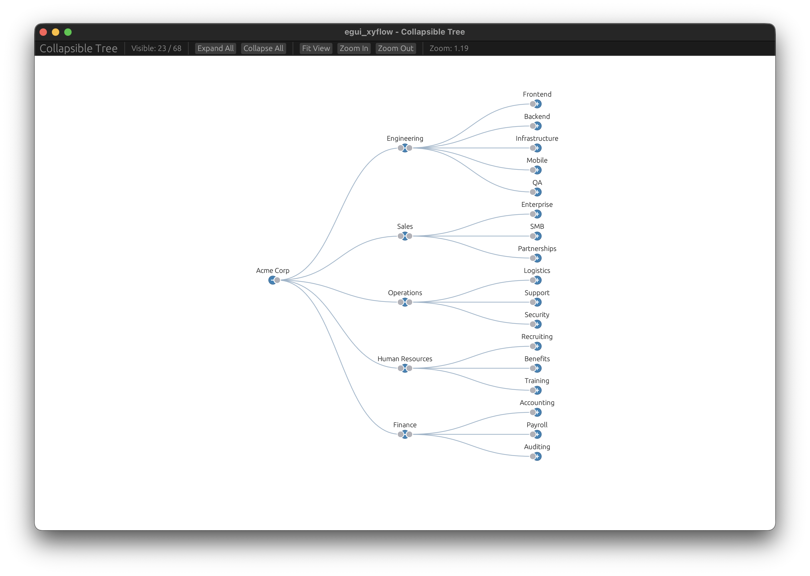<br><b>Collapsible Tree</b></td>
</tr>
<tr>
<td align="center">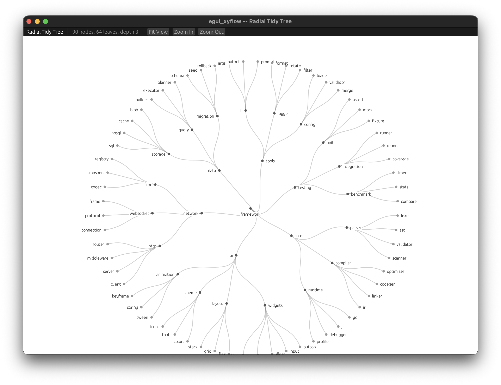<br><b>Radial Tree</b></td>
<td align="center">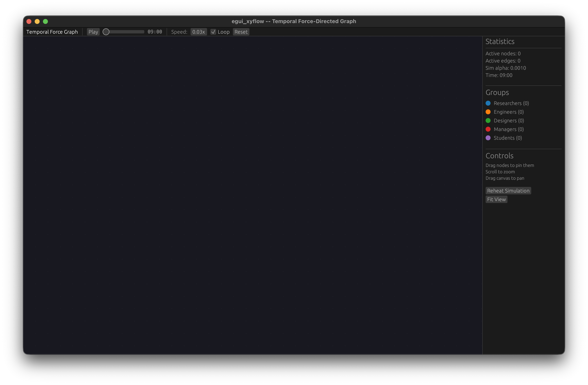<br><b>Temporal Force Graph</b></td>
</tr>
<tr>
<td align="center">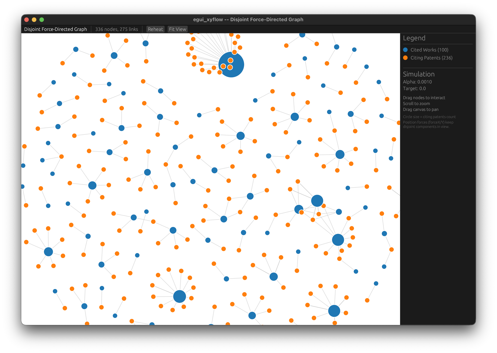<br><b>Disjoint Force Graph</b></td>
<td align="center">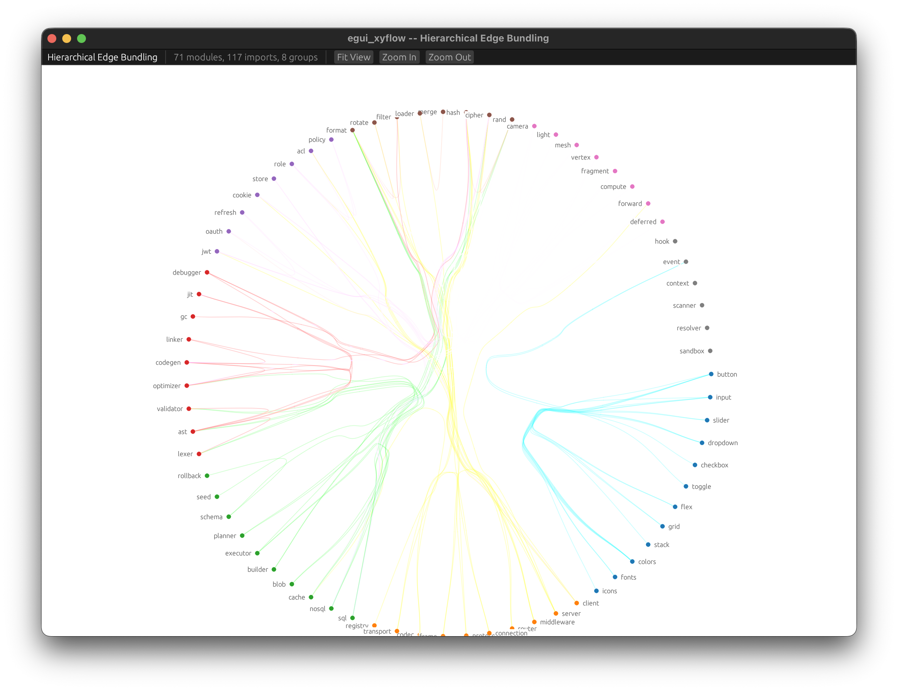<br><b>Hierarchical Edge Bundling</b></td>
</tr>
<tr>
<td align="center">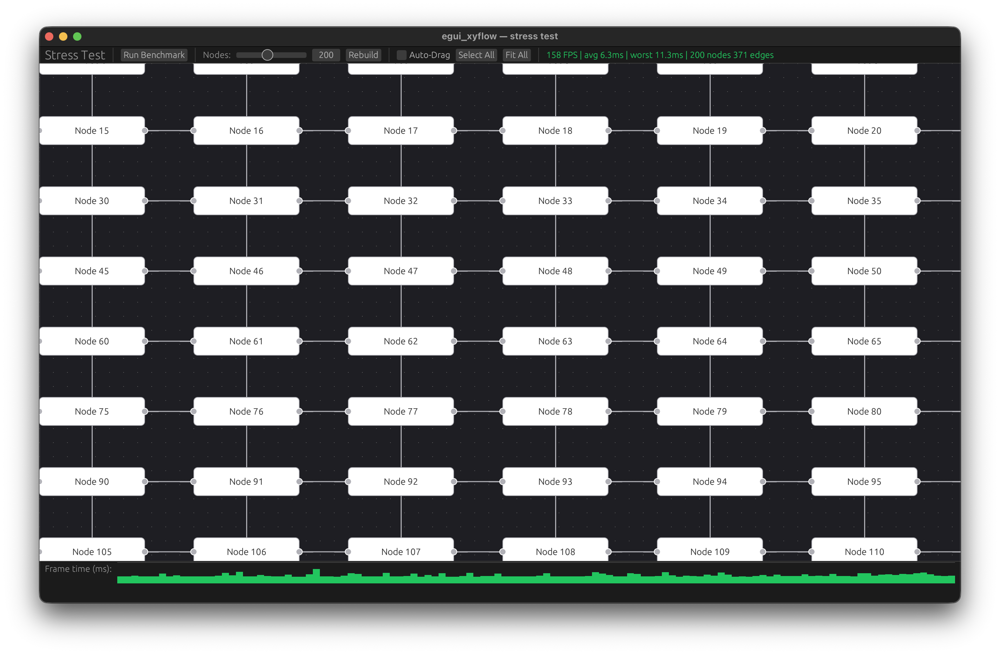<br><b>Stress Test</b></td>
<td></td>
</tr>
</table>
</details>

## Features

- **Drag-and-drop nodes** with box-select and multi-select
- **Connect nodes** by dragging between handles, with optional validation rules
- **5 edge types** — Bezier, SmoothStep, Step, Straight, SimpleBezier
- **Styled edges** — per-edge colors, stroke widths, glow effects, and dash animations
- **Pan & zoom** — scroll, pinch, double-click, or keyboard shortcuts
- **Minimap** for navigating large graphs
- **Resizable nodes** — drag handles to resize
- **Draggable edge anchors** — reposition where edges attach to nodes
- **Snap to grid** for aligned layouts
- **Background patterns** — dots, lines, or cross
- **Animated viewport transitions** with easing functions
- **Serde support** — save and load graph state (enabled by default)
- **Fully customizable** — 60+ options in `FlowConfig`, plus traits for custom node/edge rendering

## Getting Started

Add to your `Cargo.toml`:

```toml
[dependencies]
egui_xyflow = "0.1"
eframe = "0.31"
```

### Minimal Example

This creates two connected nodes:

```rust,no_run
use eframe::egui;
use egui_xyflow::prelude::*;

struct MyApp {
    state: FlowState<String, ()>,
}

impl MyApp {
    fn new() -> Self {
        let mut state = FlowState::new(FlowConfig::default());

        // Create an "Input" node with a source handle on the right
        state.add_node(
            Node::builder("1")
                .position(egui::pos2(100.0, 100.0))
                .data("Input".to_string())
                .handle(NodeHandle::source(Position::Right))
                .build(),
        );

        // Create an "Output" node with a target handle on the left
        state.add_node(
            Node::builder("2")
                .position(egui::pos2(400.0, 100.0))
                .data("Output".to_string())
                .handle(NodeHandle::target(Position::Left))
                .build(),
        );

        // Connect them with an edge
        state.add_edge(Edge::new("e1", "1", "2"));

        Self { state }
    }
}

impl eframe::App for MyApp {
    fn update(&mut self, ctx: &egui::Context, _frame: &mut eframe::Frame) {
        egui::CentralPanel::default().show(ctx, |ui| {
            let events = FlowCanvas::new(&mut self.state, &DefaultNodeWidget).show(ui);

            // React to user interactions
            for conn in &events.connections_made {
                println!("New connection: {} -> {}", conn.source, conn.target);
            }
        });
    }
}

fn main() -> eframe::Result<()> {
    eframe::run_native(
        "My Flow Editor",
        eframe::NativeOptions::default(),
        Box::new(|_cc| Ok(Box::new(MyApp::new()))),
    )
}
```

## How It Works

Each frame follows a simple cycle:

```
FlowState  →  FlowCanvas::show()  →  FlowEvents  →  apply changes  →  FlowState
```

1. **`FlowState<ND, ED>`** holds your graph — nodes, edges, viewport, and config
2. **`FlowCanvas::show(ui)`** renders the graph and returns what happened this frame
3. **`FlowEvents`** tells you about clicks, drags, new connections, selection changes, etc.
4. You react by applying **`NodeChange`** / **`EdgeChange`** back to the state

The two type parameters `ND` and `ED` are your custom data types attached to nodes and edges. Use `()` if you don't need them, or `String` for labels, or any type you want.

## Building Nodes

Use the builder pattern to create nodes:

```rust,ignore
Node::builder("my-node")
    .position(egui::pos2(200.0, 150.0))   // where to place it
    .data("Hello".to_string())             // your custom data
    .handle(NodeHandle::source(Position::Right))  // output handle on the right
    .handle(NodeHandle::target(Position::Left))   // input handle on the left
    .size(180.0, 60.0)                     // explicit size (optional)
    .z_index(10)                           // render order (optional)
    .build()
```

**Handles** are the connection points on a node. A `source` handle lets edges leave, a `target` handle lets edges arrive. Place them on any side: `Top`, `Right`, `Bottom`, `Left`, or use `Closest` to auto-track the nearest side.

## Building Edges

```rust,ignore
// Simple edge
Edge::new("e1", "source-node", "target-node")

// Styled edge
Edge::new("e2", "a", "b")
    .edge_type(EdgeType::SmoothStep)
    .color(egui::Color32::from_rgb(59, 130, 246))
    .stroke_width(3.0)
    .glow(egui::Color32::from_rgba_unmultiplied(59, 130, 246, 60), 12.0)
    .animated(true)
    .marker_end_arrow()
```

**Edge types:**
| Type | Description |
|------|-------------|
| `Bezier` | Smooth cubic curve (default) |
| `SimpleBezier` | Simplified bezier |
| `SmoothStep` | Orthogonal path with rounded corners |
| `Step` | Orthogonal path with sharp 90° corners |
| `Straight` | Direct line |

## Reacting to Events

`FlowCanvas::show()` returns `FlowEvents` — inspect it to respond to user actions:

```rust,ignore
let events = FlowCanvas::new(&mut state, &DefaultNodeWidget).show(ui);

// New connections made by dragging between handles
for conn in &events.connections_made {
    println!("{} -> {}", conn.source, conn.target);
}

// Nodes clicked
for id in &events.nodes_clicked {
    println!("Clicked: {}", id);
}

// Selection changed
if events.selection_changed {
    println!("Selected nodes: {:?}", events.selected_nodes);
    println!("Selected edges: {:?}", events.selected_edges);
}

// Nodes deleted (via Delete/Backspace key)
for id in &events.nodes_deleted {
    println!("Deleted node: {}", id);
}

// Viewport panned or zoomed
if events.viewport_changed {
    // ...
}
```

**All available events:**
| Event | Type | When it fires |
|-------|------|---------------|
| `connections_made` | `Vec<Connection>` | User completed a handle-to-handle drag |
| `connection_started` | `Option<NodeId>` | User started dragging from a handle |
| `connection_ended` | `bool` | Connection drag finished |
| `nodes_clicked` | `Vec<NodeId>` | Short click on a node |
| `edges_clicked` | `Vec<EdgeId>` | Click on an edge |
| `nodes_drag_started` | `Vec<NodeId>` | Node drag began |
| `nodes_dragged` | `Vec<(NodeId, Pos2)>` | Node moved to new position |
| `nodes_drag_stopped` | `Vec<NodeId>` | Node drag ended |
| `nodes_resized` | `Vec<(NodeId, f32, f32)>` | Node resized (id, width, height) |
| `nodes_deleted` | `Vec<NodeId>` | Nodes removed via keyboard |
| `edges_deleted` | `Vec<EdgeId>` | Edges removed via keyboard |
| `selection_changed` | `bool` | Selection state changed |
| `selected_nodes` | `Vec<NodeId>` | Currently selected nodes |
| `selected_edges` | `Vec<EdgeId>` | Currently selected edges |
| `node_hovered` | `Option<NodeId>` | Mouse is over a node |
| `edge_anchors_changed` | `Vec<(EdgeId, ...)>` | Edge endpoints were dragged |
| `viewport_changed` | `bool` | Pan, zoom, or animation occurred |

## Applying Changes

Modify graph state through the change system:

```rust,ignore
use egui_xyflow::prelude::*;

// Move a node
state.apply_node_changes(vec![
    NodeChange::Position {
        id: "my-node".into(),
        position: Some(egui::pos2(300.0, 200.0)),
        dragging: None,
    },
]);

// Remove an edge
state.apply_edge_changes(vec![
    EdgeChange::Remove { id: "e1".into() },
]);

// Add a new node
state.apply_node_changes(vec![
    NodeChange::Add {
        node: Node::builder("new").position(egui::pos2(0.0, 0.0)).build(),
        index: None,
    },
]);
```

## Viewport Control

Navigate the graph programmatically:

```rust,ignore
let time = ui.input(|i| i.time);
let rect = ui.available_rect_before_wrap();

state.fit_view(rect, 50.0, time);                  // fit all nodes with padding
state.fit_selected_nodes(rect, 50.0, time);         // fit selected nodes
state.zoom_in(time);                                // animated zoom in
state.zoom_out(time);                               // animated zoom out
state.set_center(200.0, 100.0, 1.5, rect, time);   // center on point at zoom 1.5
```

## Validation

Control which connections are allowed:

```rust,ignore
struct MyValidator;

impl ConnectionValidator for MyValidator {
    fn is_valid_connection(
        &self,
        connection: &Connection,
        existing_edges: &[EdgeInfo<'_>],
    ) -> bool {
        // Prevent self-connections
        if connection.source == connection.target {
            return false;
        }
        // Prevent duplicate edges
        !existing_edges.iter().any(|e| {
            e.source == connection.source && e.target == connection.target
        })
    }
}

// Use it when rendering
FlowCanvas::new(&mut state, &widget)
    .connection_validator(&MyValidator)
    .show(ui);
```

## Custom Node Rendering

Implement the `NodeWidget` trait to control how nodes look:

```rust,ignore
struct MyRenderer;

impl NodeWidget<MyData> for MyRenderer {
    fn size(&self, node: &Node<MyData>, config: &FlowConfig) -> egui::Vec2 {
        egui::vec2(200.0, 80.0)
    }

    fn show(
        &self,
        painter: &egui::Painter,
        node: &Node<MyData>,
        screen_rect: egui::Rect,
        config: &FlowConfig,
        hovered: bool,
        transform: &Transform,
    ) {
        // Draw anything you want with the egui Painter
        painter.rect_filled(screen_rect, 8.0, egui::Color32::from_rgb(30, 30, 46));
        painter.text(
            screen_rect.center(),
            egui::Align2::CENTER_CENTER,
            &node.data.label,
            egui::FontId::proportional(14.0 * transform.scale),
            egui::Color32::WHITE,
        );
    }
}
```

**Built-in renderers:**
- `DefaultNodeWidget` — renders `Node<String>` with label text
- `UnitNodeWidget` — renders `Node<()>` as plain boxes

## Custom Edge Rendering

Implement `EdgeWidget` for custom edge paths:

```rust,ignore
struct MyEdgeRenderer;

impl EdgeWidget<()> for MyEdgeRenderer {
    fn show(
        &self,
        painter: &egui::Painter,
        edge: &Edge<()>,
        pos: &EdgePosition,
        config: &FlowConfig,
        time: f64,
        transform: &Transform,
    ) {
        // Draw custom edge path
    }
}

FlowCanvas::new(&mut state, &node_widget)
    .edge_widget(&MyEdgeRenderer)
    .show(ui);
```

## Configuration

`FlowConfig` has 60+ options. Here are the most commonly adjusted:

```rust,ignore
let mut config = FlowConfig::default();

// Interaction
config.nodes_draggable = true;
config.nodes_connectable = true;
config.nodes_selectable = true;
config.nodes_resizable = true;
config.snap_to_grid = true;
config.snap_grid = [20.0, 20.0];

// Viewport
config.min_zoom = 0.1;
config.max_zoom = 4.0;
config.pan_on_drag = true;
config.zoom_on_scroll = true;
config.zoom_on_pinch = true;

// Appearance
config.default_edge_type = EdgeType::SmoothStep;
config.background_variant = BackgroundVariant::Dots;
config.show_minimap = true;

// Colors
config.node_bg_color = egui::Color32::from_rgb(30, 30, 46);
config.edge_color = egui::Color32::from_rgb(100, 100, 140);

let state = FlowState::new(config);
```

See the [docs](https://docs.rs/egui_xyflow) for the full list of options.

## Examples

Clone the repo and run any of the 15 included examples:

```bash
git clone https://github.com/avinkrism4pro/egui_xyflow
cd egui_xyflow

cargo run --example basic_flow               # getting started
cargo run --example data_pipeline            # pipeline with validation
cargo run --example state_machine            # state diagram
cargo run --example neural_network           # layer visualizer
cargo run --example dependency_graph         # package dependencies
cargo run --example logic_gates              # circuit diagram
cargo run --example collapsible_tree         # expand/collapse hierarchy
cargo run --example radial_tree              # radial layout
cargo run --example sankey_diagram           # flow quantities
cargo run --example chord_diagram            # relationship matrix
cargo run --example arc_diagram              # arc connections
cargo run --example temporal_force_graph     # force-directed layout
cargo run --example disjoint_force_graph     # clustered force layout
cargo run --example hierarchical_edge_bundling  # bundled edges
cargo run --example stress_test              # performance benchmark
```

## Compatibility

| egui_xyflow | egui |
|-------------|------|
| 0.1         | 0.31 |

## License

MIT
